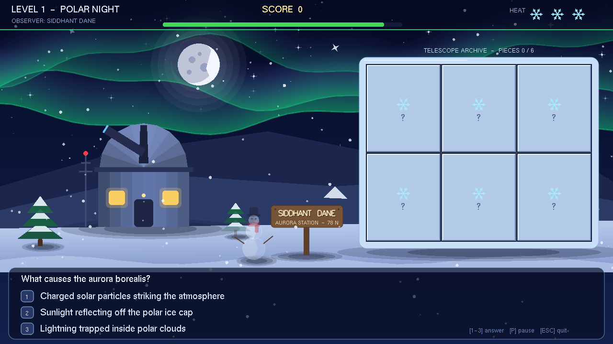
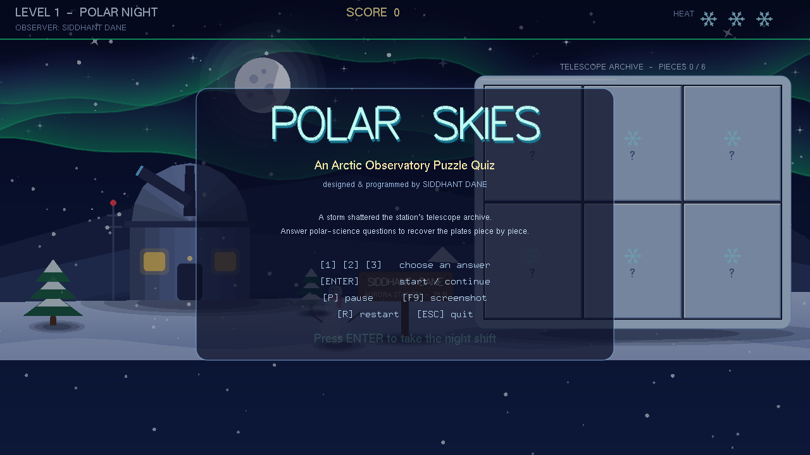
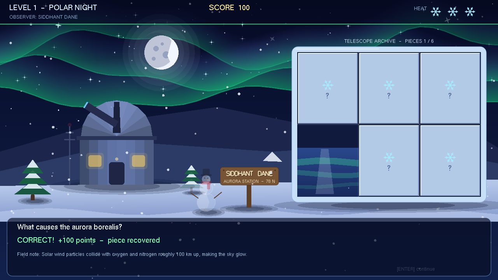
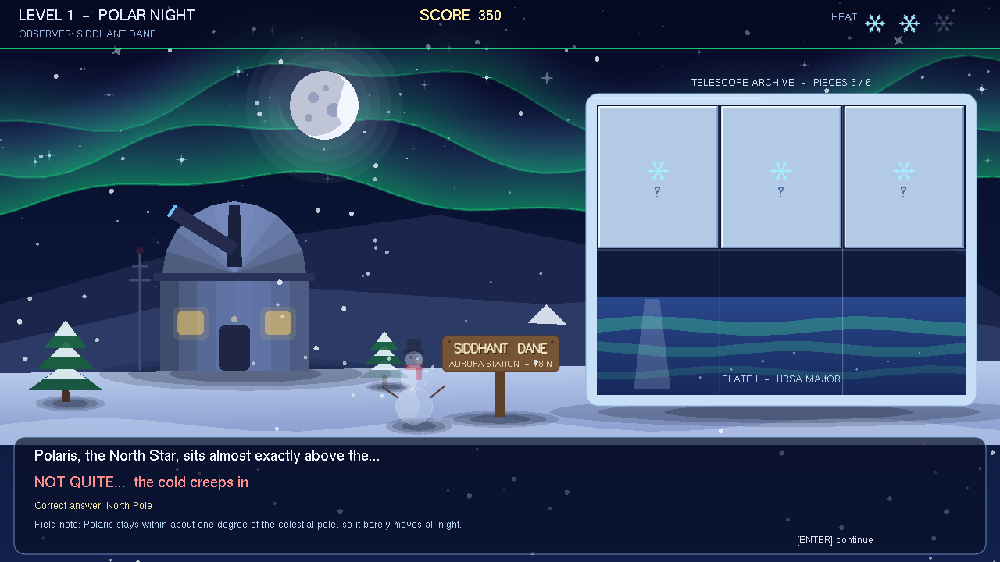
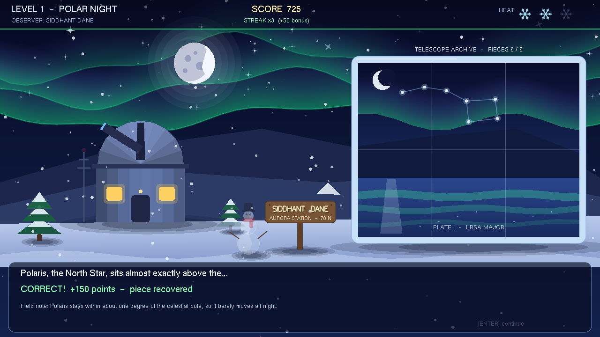
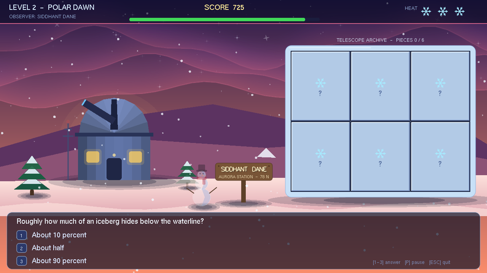
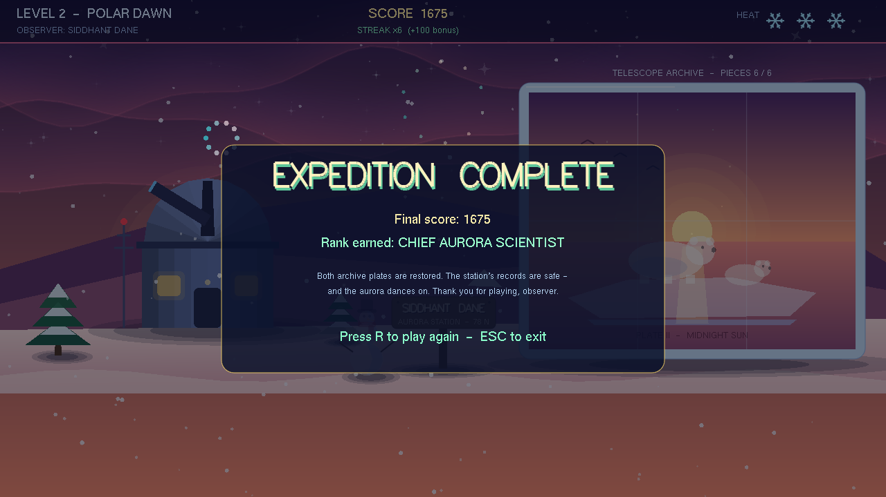
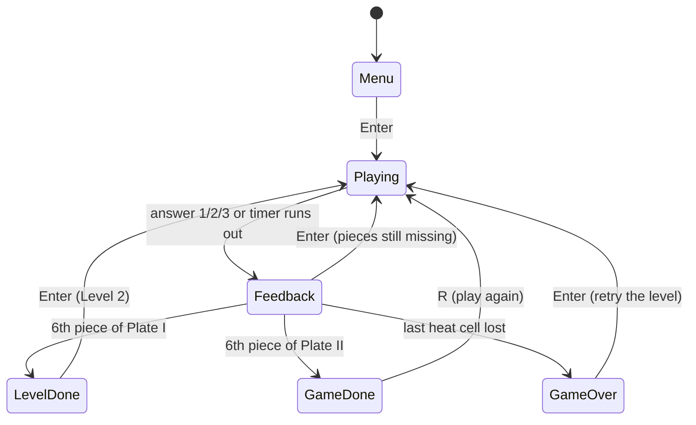

# Computer Science for Digital Engineering

## Task 1 — Polar Skies: An Arctic Observatory Puzzle Quiz


> You are the night-shift observer at a remote Arctic research station. A storm has shattered the
> station's telescope archive. Answer polar-science questions to recover the archive plates, one
> piece at a time.



## What's in this folder

| File | Description |
|---|---|
| [`main.cpp`](main.cpp) | The complete, commented source code in a single file (1,440 lines) |
| [`PolarSkies.exe`](PolarSkies.exe) | Ready-to-run 64-bit Windows build with no DLLs or installation needed |
| [`screenshots/`](screenshots/) | Captures of every game state, taken with the in-game F9 key |

## Quick start

On Windows, download **`PolarSkies.exe`** and double-click it. Press **Enter** on the title screen
to take the night shift.

## How to play

| Key | Action |
|---|---|
| `1` `2` `3` | Choose an answer |
| `Enter` | Start the game / continue after feedback / move to the next level |
| `P` | Pause (freezes the question timer) |
| `F9` | Save a screenshot as a `.bmp` next to the game |
| `R` | Restart from the beginning |
| `Esc` | Quit |

**Rules.** Every question has a **20-second timer**.

- **Correct answer:** you recover one puzzle piece and score **100 points**, plus a streak bonus
  of **25 per consecutive correct answer** (capped at +100).
- **Wrong answer or timeout:** you lose one **heat cell** and **25 points**, see the correct answer
  with a field note, and the question comes back later, so a plate can always be finished.
- **All three heat cells lost:** a whiteout hits and the level restarts.

Restore **Plate I** (six pieces) to unlock the polar dawn and **Plate II**. Restoring both
completes the expedition and awards a rank from *Trainee Observer* up to *Chief Aurora Scientist*.

## Gameplay tour

| | |
|---|---|
|  |  |
| **Title screen** with controls and story | **Correct answer:** a piece is recovered and a field note appears |
|  |  |
| **Wrong answer:** the correct answer is shown and the question returns later | **Plate I restored:** the Great Bear over the icefjord |
|  |  |
| **Level 2, the Polar Dawn:** a new background and a new plate | **Expedition complete:** final score and earned rank |

## How the brief is covered

| Requirement | Implementation |
|---|---|
| **1. Game environment** | Animated aurora curtains, 150 drifting snowflakes, 130 twinkling stars, a layered moon, a shaded observatory with a blinking radio mast, snowy pines and a snowman |
| **2. Puzzle design** | Each level has a 3 × 2 archive plate; one tile is revealed per correct answer |
| **3. Question & answer logic** | 12 questions (6 per level) with correct, incorrect and timeout handling, and a field note after every answer |
| **4. Interactive gameplay** | Keyboard only: `1`–`3`, `Enter`, `P`, `R`, `F9`, `Esc` |
| **5. Scene progression** | Level 2 brings a new background (polar dawn) and a new puzzle, then a completion screen with a rank |
| **6. Three-dimensional appearance** | Layered shading on the moon, dome and cylindrical wall, soft drop shadows, and overlapping mountain ridges |
| **7. Name engraving** | A carved wooden signpost reading **SIDDHANT DANE** stands in the scene, and the HUD credits the observer by name |
| **Bonus features** | Question timer, score with streak bonus, heat-cell lives, red/green edge flashes, continuous animation, pause, and F9 screenshots |

## Technical highlights

- **Resolution-independent canvas.** Everything is drawn in a fixed 1280 × 720 logical space with an
  orthographic projection, so the scene scales cleanly with the window.
- **Scissor-clipped puzzle reveal.** For every recovered tile, the full plate picture is redrawn but
  clipped with `glScissor` to that tile's rectangle, so the pieces always line up perfectly.
- **Aurora curtains.** Alpha-blended `GL_QUAD_STRIP`s ride two superimposed sine waves. They are bright
  at the hem and fade upward.
- **Fake 3D with layered shapes.** The observatory wall is 8 vertical slices shaded along a cosine curve.
  The dome is shaded in lunes. Drop shadows are stacked translucent ellipses.
- **Particle snowfall.** 150 flakes fall at their own speed, sway on a sine wave and respawn at the top.
- **Palette-driven levels.** Level 2 reuses the whole rendering pipeline with a new palette and a
  low sun instead of the moon.
- **Built-in screenshot writer.** F9 reads the framebuffer with `glReadPixels` and writes a 24-bit BMP
  without any external image library.

### Game flow (finite state machine)



Pause is a flag inside `Playing`, and `R` restarts from any state.

## Code map (`main.cpp`)

| # | Section | What it contains |
|---|---|---|
| 1 | Utilities & global state | Logical canvas size, maths helpers, game state enum, score/lives/timer variables |
| 2 | Question bank | 12 `Question` structs (text, 3 options, correct index, field note) |
| 3 | Level palettes | Night and dawn colour sets that drive the whole scene |
| 4 | Drawing helpers | Circles, ellipses, rounded rectangles, stars, bitmap and stroke text, drop shadows |
| 5 | Environment | Sky, starfield, aurora, moon/sun, mountains, observatory, pines, snowman, signpost, snow |
| 6 | Puzzle plates | Plate I (Great Bear) and Plate II (Midnight Sun) pictures and the scissor reveal |
| 7 | HUD & panels | Score, streak, heat cells, timer bar, question panel, menu, level/game screens |
| 8 | Game logic | Starting levels, answer handling, re-queueing missed questions, state transitions |
| 9 | Screenshot | F9 framebuffer dump to BMP |
| 10 | GLUT callbacks | Display, reshape, ~60 fps timer tick, keyboard input |
| 11 | Initialisation | Seeded starfield and snowflakes, OpenGL state, `main()` |

## Question bank

| Level 1 — The Polar Night (aurora & night sky) | Level 2 — The Polar Dawn (Arctic geography & wildlife) |
|---|---|
| What causes the aurora borealis | How much of an iceberg hides below the waterline |
| Which gas gives the aurora its green colour | Which ocean surrounds the North Pole |
| Which constellation contains the Big Dipper | The colour of a polar bear's skin |
| Where Polaris sits in the sky | What permafrost is |
| What shields Earth from the solar wind | What the Sun does at the North Pole in midsummer |
| The name of the southern aurora | Which Arctic animal makes the longest migration |

## Building from source

**Windows (MSYS2 / MinGW-w64)**

```bash
pacman -S mingw-w64-x86_64-gcc mingw-w64-x86_64-freeglut
g++ main.cpp -o PolarSkies.exe -lfreeglut -lopengl32 -lwinmm -lgdi32
```

Run it from the MSYS2 MinGW64 shell, or copy `libfreeglut.dll` next to the `.exe`.

**Windows (Visual Studio)**

Create an empty C++ project, add `main.cpp`, install the **freeglut** NuGet package
(*Project → Manage NuGet Packages*) and build.

**Linux (Debian / Ubuntu)**

```bash
sudo apt install g++ freeglut3-dev
g++ main.cpp -o polarskies -lglut -lGL -lm
./polarskies
```

**macOS**

```bash
clang++ main.cpp -o polarskies -framework OpenGL -framework GLUT
./polarskies
```

The source already silences Apple's GLUT deprecation warnings.

**How the bundled `.exe` was made:** freeglut 3.6.0 was compiled as a static library with MinGW-w64
and linked with `-static`, which is why `PolarSkies.exe` runs on any 64-bit Windows machine
without extra DLLs.

## Notes

- The whole scene is built from OpenGL primitives only: gradients, circles, polygons, quad strips
  and GLUT stroke/bitmap text. No image files are loaded.
- The window opens at 1280 × 720 and can be resized freely.

---

**Author:** Siddhant Dane · Computer Science for Digital Engineering · ← [Back to the main README](../README.md)

