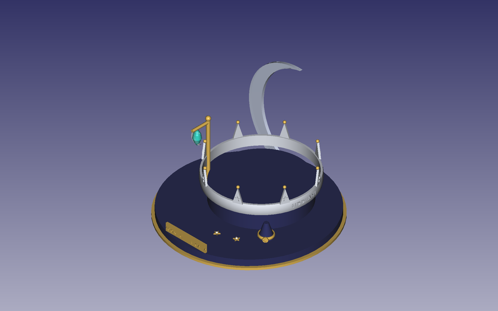
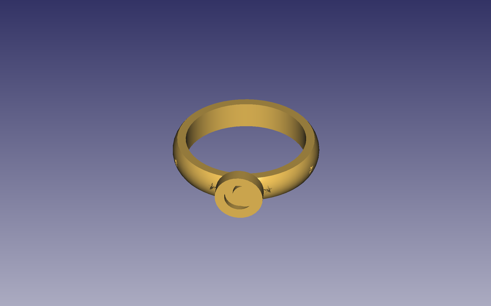
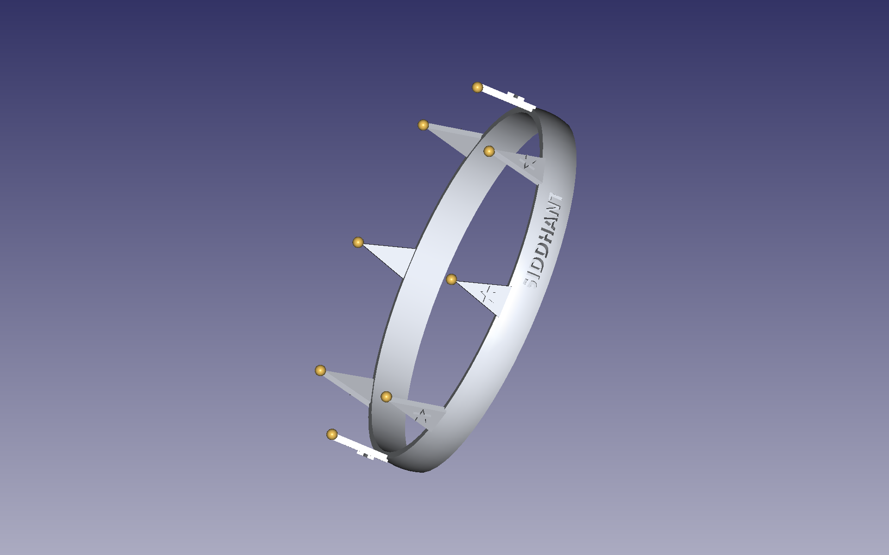
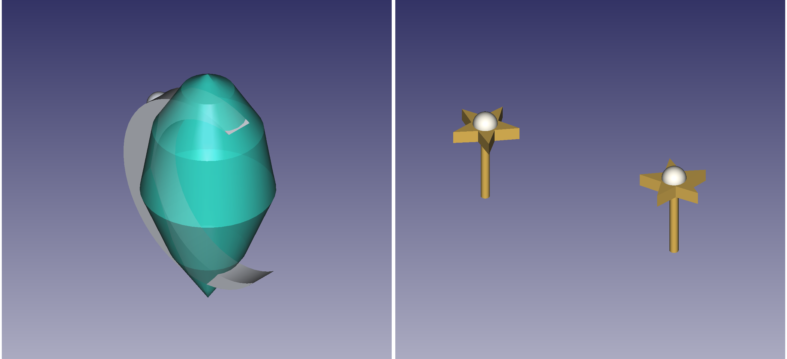
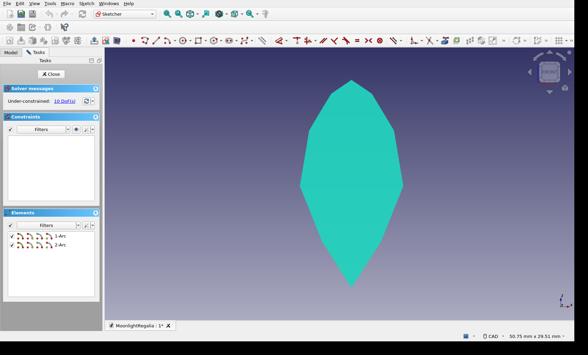
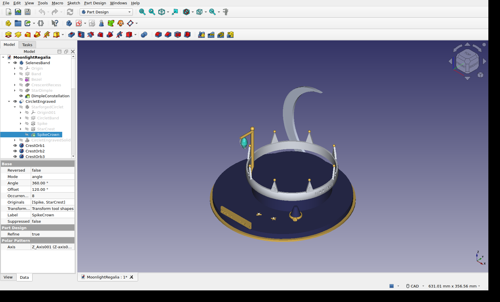
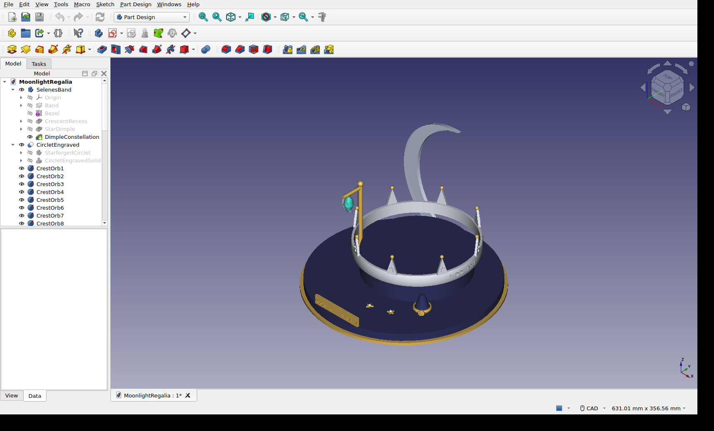

# Computer Science for Digital Engineering

## Task 2 — Moonlight Regalia: A Celestial Fantasy Jewellery Collection


> The ceremonial jewellery of an imagined lunar-elven court. Four pieces, one file and one strict
> design vocabulary: crescents, five-pointed stars, teardrops and orbs, finished in silver,
> moon-gold, pearl and a single aurora-teal gemstone.



## What's in this folder

| File | Description |
|---|---|
| [`MoonlightRegalia.FCStd`](MoonlightRegalia.FCStd) | The FreeCAD 1.0 project with every sketch, body and the presentation scene |
| [`renders/`](renders/) | Rendered views of each piece and captures of the FreeCAD window |

## The collection

| Piece | Finish | How it is built | Size |
|---|---|---|---|
| **Selene's Band** (ring) | Gold | A comfort-fit profile is **revolved** into the band, a round **bezel** is added, a crescent moon is **pocketed** into it, and one star dimple is **polar-patterned** eight times around the band | 17 mm bore (ISO 8653 size 53) |
| **Star-forged Circlet** (crown) | Silver, moon-gold orbs | A revolved band; a spike and its star crest are **padded**, then **polar-patterned** together eight times; eight gold orbs sit on the tips; **SIDDHANT** is engraved into the spike-free front | 136 mm inner diameter |
| **Aurora Tear** (pendant) | Teal gem, silver frame | A six-point profile is **revolved** into a briolette-cut gem; the frame is a **padded** crescent cradle with a torus bail and three granulation beads | ~27 mm tall incl. bail |
| **Starlight Studs** (earrings) | Gold, pearl | A **padded** five-point star plate with a pearl and an ear post; the second earring is an **App Link** of the first | ~8 mm star |

<p align="center">
  
  
  
</p>
<p align="center"><em>Selene's Band · the Star-forged Circlet with the engraved name · the Aurora Tear and Starlight Studs</em></p>

### The presentation scene

All four pieces sit on a jeweller's stage built for the purpose. There's a gold base under a navy
velvet top, a drum riser for the circlet, a cone for the ring, and a hanging stand whose arm passes
through the pendant's bail. The studs are pinned into the velvet. A large crescent-moon backdrop
rises behind the crown, and an engraved **MOONLIGHT REGALIA** plaque sits on the front rim.

## Modelling workflow

Every piece starts as a **2D sketch** and becomes a solid through Part Design features, so the
file keeps a full, editable history.

1. **Sketch.** Draw the profile in the Sketcher: a band cross-section, a spike outline, a star or a crescent.
2. **Build the solid.** *Revolution* for round forms, *Pad* for raised shapes and *Pocket* for recesses.
3. **Repeat.** *Polar Pattern* copies features around the axis (star dimples ×8, spikes + crests ×8).
4. **Personalise.** A *ShapeString* of the name is extruded and subtracted from the circlet with a Boolean cut.
5. **Stage and render.** Pieces are placed on the stage, coloured by material, and construction geometry is hidden.

**One reusable construction:** the crescent is built from two intersecting circles by keeping the outer
arc of one and the facing arc of the other. It appears three times at three scales, with outer radii
of about 2 mm (engraved into the ring bezel), 8.6 mm (padded as the pendant cradle) and 78 mm
(padded again as the stage backdrop).

| Sketch → solid | Pattern feature | Named feature history |
|---|---|---|
|  |  |  |
| The pendant cradle's two-arc crescent sketch in the Sketcher | `SpikeCrown` polar pattern: 360°, 8 occurrences of `Spike` + `StarCrest` | The finished document with the feature tree expanded |

## Feature tree

```
MoonlightRegalia.FCStd
├── SelenesBand ................ Body (gold ring)
│   ├── BandProfile → Band ......................... Sketch → Revolution
│   ├── Bezel ...................................... Additive Cylinder
│   ├── CrescentEmblem → CrescentRecess ............ Sketch → Pocket
│   └── DimpleSketch → StarDimple → DimpleConstellation
│                                                    Sketch → Pocket → Polar Pattern ×8
├── StarforgedCirclet .......... Body (silver crown)
│   ├── CircletProfile → CircletBand ............... Sketch → Revolution
│   ├── SpikeSketch → Spike ........................ Sketch → Pad
│   ├── StarCrestSketch → StarCrest ................ Sketch → Pad
│   └── SpikeCrown ................................. Polar Pattern ×8 (Spike + StarCrest)
├── CircletEngraved ............ Part Cut: circlet − extruded ShapeString "SIDDHANT"
├── CrestOrb1 … CrestOrb8 ...... Spheres (moon-gold orbs)
├── AuroraTearGem .............. Body: BrioletteProfile → Briolette (Revolution)
├── AuroraTearFrame ............ Body: CradleSketch → CrescentCradle (Pad),
│                                      Bail (Additive Torus), Bead1–3 (Additive Spheres)
├── StarlightStud .............. Body: StarPlateSketch → StarPlate (Pad), EarPost (Additive Cylinder)
├── StarlightStudTwin .......... App Link to StarlightStud
├── StudPearl, StudPearlTwin ... Spheres (pearls)
└── Presentation stage
    ├── GoldBase, VelvetTop, CrownRiser, RingCone
    ├── StandPost, StandArm, StandFinial
    ├── MoonBackdrop ........... Body: MoonSketch → MoonPanel (Pad)
    └── PlaqueEngraved ......... Part Cut: TitlePlaque − extruded ShapeString "MOONLIGHT REGALIA"
```

## Opening and exploring the file

1. Open **`MoonlightRegalia.FCStd`** in **FreeCAD 1.0 or newer**. The scene opens with colours
   applied and construction geometry hidden.
2. Expand a body in the model tree (for example `SelenesBand`) to see its full history. Every
   feature is named after what it does.
3. Double-click any sketch (`BandProfile`, `CradleSketch`, `SpikeSketch` and so on) to open it
   in the Sketcher and see the original 2D geometry.
4. Right-click a mid-history feature and choose **Move to tip** to preview the body at an
   earlier modelling stage.
5. The engraved name lives in `CircletEngraved`: a ShapeString extruded and cut into the curved band.

## Scale and manufacturing

Everything is modelled in **real millimetres**. The ring's 17 mm bore has an inner circumference of
53.4 mm, which is **size 53 under ISO 8653**. The circlet is 136 mm across the inside, the pendant
is about 27 mm tall including the bail, and the stage is 224 mm wide.

Every body was checked as a single valid, watertight solid. That means each piece can be exported
as **STL** (select it in the tree, then *File → Export…*), 3D-printed as a wax or resin pattern
and **lost-wax cast**, which is a common route from jewellery CAD to finished metal.

## Rendered views

| File | Shows |
|---|---|
| `scene_iso.png`, `scene_front.png`, `scene_right.png` | The full presentation scene from three angles |
| `obj_ring.png` | Selene's Band |
| `obj_circlet.png`, `obj_circlet_name.png` | The Star-forged Circlet, and a view angled to read the engraving |
| `obj_pendant.png`, `obj_studs.png`, `pendant_studs.png` | The Aurora Tear and the Starlight Studs |
| `obj_backdrop.png` | The crescent-moon stage backdrop |
| `window_stateA.png`, `window_stateB.png`, `window_stateC.png` | FreeCAD window captures: feature tree, polar pattern properties, sketch editing |

---

**Author:** Siddhant Dane · Computer Science for Digital Engineering · ← [Back to the main README](../README.md)

